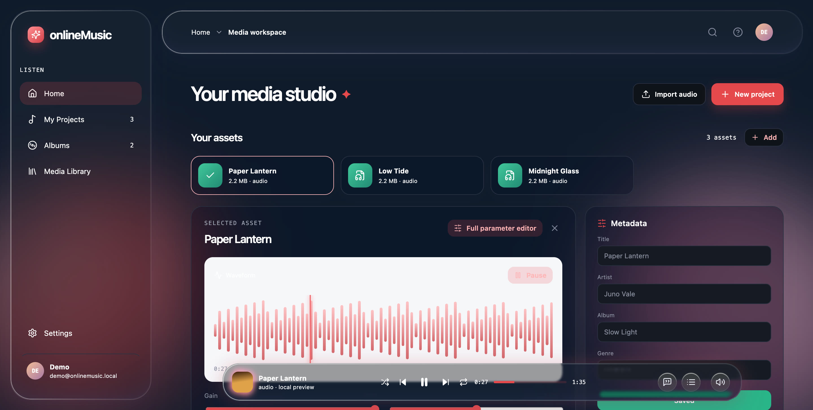

# onlineMusic

A local-first music workbench: collect audio, video, and images into your own media library, read embedded tags and cover art, then preview, inspect waveforms, and edit metadata right in the browser. The interface is a fully hand-built frosted glass system (backdrop-filter + edge refraction + ink colour that adapts to the backdrop), with no external services.



## Features

- **Local accounts** — email + password sign-up and sign-in, salted `scrypt` hashes, sessions in an HttpOnly cookie valid for one year. All data stays on your own disk.
- **Media ingestion** — audio `wav / mp3 / flac / aiff / m4a / ogg`, video `mp4 / mov / webm`, images `png / jpg / jpeg / webp`, up to 10000 assets per account.
- **Automatic tag reading** — embedded title, artist, album, and cover art are parsed in the browser on import.
- **Waveform and playback controls** — drag the waveform to seek, adjustable gain and playback rate, shuffle / previous / next / loop, plus a fullscreen Now Playing view.
- **Metadata editing** — title, artist, album, genre, lyrics, description, and tags.
- **Library views** — grouped by album; the index streams line by line as NDJSON and covers are fetched on demand, so even large libraries show their first rows immediately.
- **Responsive** — sidebar + workbench on desktop; a bottom pill navigation and fullscreen lyrics on narrow screens.

## Tech stack

| | |
|---|---|
| Framework | Next.js 14 (App Router, standalone output) |
| Language | TypeScript |
| UI | React 18 + hand-written CSS (`styles/`), icons from lucide-react |
| Tag parsing | music-metadata |
| Storage | JSON index on the file system + media directory |
| Deployment | Docker / docker-compose, named volume `music_data` |

## Quick start

```bash
npm install
npm run dev            # http://localhost:3000
```

For production, use Docker:

```bash
./build.sh             # docker-compose build && docker-compose up -d
```

The container serves **both https and http on the same port** (3000): the front door reads the
first byte of each connection, so `https://192.168.1.156:3000` and `http://192.168.1.156:3000`
answer alike and an older client that still says http keeps working. The first start generates a
self-signed certificate into the data volume — `TLS_HOSTS` names the addresses it should cover,
so set it to the one clients use (e.g. `TLS_HOSTS: 192.168.1.156`) — or mount your own pair with
`TLS_CERT_FILE`/`TLS_KEY_FILE`, or set `TLS_DISABLE=1` to serve plain http only.

On macOS, `build.sh` also trusts that generated certificate for the current user
(`./scripts/trust-cert.sh`; `--system` covers every user and asks for an admin password), so
Safari, Chrome and the desktop app open `https://192.168.1.156:3000` without a warning. Run the
script again whenever the certificate is regenerated (a fresh data volume). Health checks can
keep using `curl -k https://localhost:3000`, which also works on machines that have not run it.

## Desktop app (macOS)

The same interface packages as a `.app`: an Electron shell (`desktop/`) around the static export
of the UI. The app is a pure client — it bundles no server and no data; accounts and media are
fetched from the API server the app was packaged against. No client has a Settings → Server
card: a browser page talks to its own origin, and the app's address is fixed at packaging time.

```bash
npm install
npm run package:mac    # builds dist/onlineMusic.app, pointed at https://192.168.1.156:3000
npm run package:mac -- --server=http://192.168.1.156:3000  # plain-http build — no persistent login
```

`--server` must be a full `http://` or `https://` URL and is baked into the shell: preload.js
carries the address, tls.js the certificate policy. Without it the app falls back to
`http://localhost:3000`.

An https build accepts the packaged host's certificate even when it is self-signed — Caddy's
`tls internal` on a LAN needs no root CA on the Mac — while every other host keeps Chromium's own
verification, and a revoked certificate is refused even for that host (see `desktop/tls.js`).
Once the certificate is trusted on the Mac (above), Chromium's own verification succeeds and the
exemption is just the fallback for machines that have not installed it.

The shell serves the UI from a privileged `app://bundle` scheme, so its origin is stable and the
server can allowlist it. For the app to reach the server:

1. Allow the app's origin on the server (uncomment in `docker-compose.yml`):
   `ALLOWED_ORIGINS: app://bundle`
2. Serve the API over https when the app should stay signed in — the Docker container already
   terminates TLS on its own port, so package the app against that same `https://` address.
   Cross-origin sessions are `SameSite=None; Secure`, and a plain-http API on a LAN IP cannot
   store such a cookie (only `localhost` is exempt), so an http build browses but forgets the
   login.

Any other client can be hosted the same way: `npm run build:client` produces the static export
in `out/`, and the server answers whichever origins `ALLOWED_ORIGINS` lists (comma-separated,
credentials included). A client on a *different machine* needs the API behind HTTPS — the
web container terminates its own TLS, and the commented `proxy` service adds Caddy when a
publicly trusted certificate is wanted (see `Caddyfile`) — because cross-origin session cookies
are `SameSite=None; Secure`, and browsers only store Secure cookies over https (localhost
excepted).

The UI itself is the same in both shells.

## Where data lives

All state lives under the directory pointed to by `AUTH_DATA_DIR` (default `./data`):

```
data/
├── accounts.json      # accounts, password hashes, sessions
├── assets.json        # media index and metadata
└── media/             # uploaded original files, named by uuid
```

In a Docker deployment that directory is the named volume `music_data`, so rebuilding the container does not lose data.

## Directory structure

```
app/
├── page.tsx           # main workbench: library, editor, player state
├── bottom-pill.tsx    # narrow-screen bottom navigation
├── layout.tsx
└── api/
    ├── auth/          # register / login / logout / current session
    └── assets/        # list (NDJSON streaming index), upload, detail, cover, original file
features/
├── glass/             # the Liquid Glass system (engine, settings, markers)
├── lyrics/            # lyrics editor and playback rendering
├── now-playing/       # fullscreen Now Playing view
├── player/            # waveform seek bar and media clock
├── appearance/        # theme and appearance settings
├── parameters/        # playback parameter controls
└── video/             # video overlay
lib/
├── accounts.ts        # account and session storage
├── assets.ts          # media index storage
├── asset-validation.ts# input validation
├── embedded-tags.ts   # embedded tag and cover parsing
├── glassEdge.ts       # glass edge refraction (SVG displacement filter)
└── inkSampler.ts      # samples the backdrop to derive the text ink colour
styles/
├── shared.css         # shared tokens and primitives
├── shell.css          # app shell styles
└── now.css            # now playing / lyrics styles
shared/
├── lyrics/            # karaoke parse / timeline / edit, shared code
├── types/             # shared media types
└── utilities/         # media, settings, and time helpers
```
